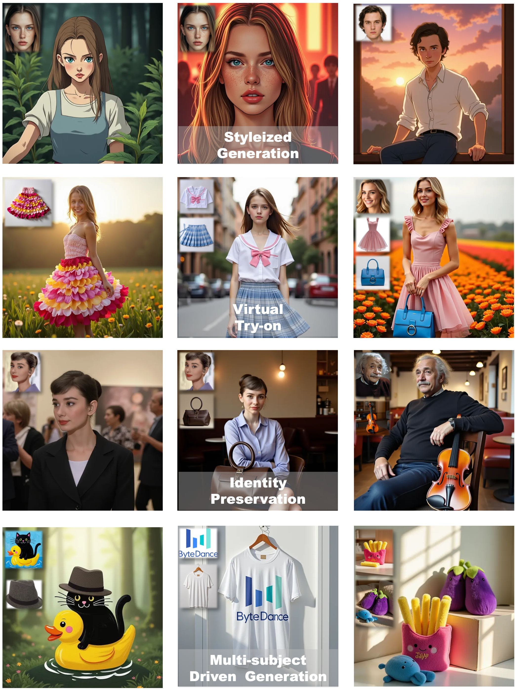

<h3 align="center">
    
    Less-to-More Generalization: Unlocking More Controllability by In-Context Generation
</h3>

<p align="center"> 
<a href="https://bytedance.github.io/UNO/"></a> 
<a href="https://arxiv.org/abs/2504.02160"></a>
<a href="https://huggingface.co/bytedance-research/UNO"></a>
</p>

><p align="center"> <span style="color:#137cf3; font-family: Gill Sans">Shaojin Wu,</span><sup></sup></a>  <span style="color:#137cf3; font-family: Gill Sans">Mengqi Huang</span><sup>*</sup>,</a> <span style="color:#137cf3; font-family: Gill Sans">Wenxu Wu,</span><sup></sup></a>  <span style="color:#137cf3; font-family: Gill Sans">Yufeng Cheng,</span><sup></sup> </a>  <span style="color:#137cf3; font-family: Gill Sans">Fei Ding</span><sup>+</sup>,</a> <span style="color:#137cf3; font-family: Gill Sans">Qian He</span></a> <br> 
><span style="font-size: 16px">Intelligent Creation Team, ByteDance</span></p>

<p align="center">

</p>

## 🔥 News
- [04/2025] 🔥 The [training code](https://github.com/bytedance/UNO), [inference code](https://github.com/bytedance/UNO), and [model](https://huggingface.co/bytedance-research/UNO) of UNO are released. The [demo](https://huggingface.co/spaces/bytedance-research/UNO-FLUX) will coming soon.
- [04/2025] 🔥 The [project page](https://bytedance.github.io/UNO) of UNO is created.
- [04/2025] 🔥 The arXiv [paper](https://arxiv.org/abs/2504.02160) of UNO is released.

## 📖 Introduction
In this study, we propose a highly-consistent data synthesis pipeline to tackle this challenge. This pipeline harnesses the intrinsic in-context generation capabilities of diffusion transformers and generates high-consistency multi-subject paired data. Additionally, we introduce UNO, which consists of progressive cross-modal alignment and universal rotary position embedding. It is a multi-image conditioned subject-to-image model iteratively trained from a text-to-image model. Extensive experiments show that our method can achieve high consistency while ensuring controllability in both single-subject and multi-subject driven generation.


## ⚡️ Quick Start

### 🔧 Requirements and Installation

Install the requirements
```bash
## create a virtual environment with python >= 3.10 <= 3.12, like
# python -m venv uno_env
# source uno_env/bin/activate
# then install
pip install -r requirements.txt
```

then download checkpoints in one of the three ways:
1. Directly run the inference scripts, the checkpoints will be downloaded automatically by the `hf_hub_download` function in the code to your `$HF_HOME`(the default value is `~/.cache/huggingface`).
2. use `huggingface-cli download <repo name>` to download `black-forest-labs/FLUX.1-dev`, `xlabs-ai/xflux_text_encoders`, `openai/clip-vit-large-patch14`, `TODO UNO hf model`, then run the inference scripts.
3. use `huggingface-cli download <repo name> --local-dir <LOCAL_DIR>` to download all the checkpoints menthioned in 2. to the directories your want. Then set the environment variable `TODO`. Finally, run the inference scripts.

### 🌟 Gradio Demo

```bash
python app.py
```


### ✍️ Inference

- Optional prepreration: If you want to test the inference on dreambench at the first time, you should clone the submodule `dreambench` to download the dataset.

```bash
git submodule update --init
```


```bash
python inference.py
```

### 🚄 Training

```bash
accelerate launch train.py
```

## 🎨 Application Scenarios
<p align="center">

</p>

## 📄 Disclaimer
<p>
We open-source this project for academic research. The vast majority of images 
used in this project are either generated or licensed. If you have any concerns, 
please contact us, and we will promptly remove any inappropriate content. 
Our code is released under the Apache 2.0 License,, while our models are under 
the CC BY-NC 4.0 License. Any models related to <a href="https://huggingface.co/black-forest-labs/FLUX.1-dev" target="_blank">FLUX.1-dev</a> 
base model must adhere to the original licensing terms.
<br><br>This research aims to advance the field of generative AI. Users are free to 
create images using this tool, provided they comply with local laws and exercise 
responsible usage. The developers are not liable for any misuse of the tool by users.</p>

## 🚀 Updates
For the purpose of fostering research and the open-source community, we plan to open-source the entire project, encompassing training, inference, weights, etc. Thank you for your patience and support! 🌟
- [x] Release github repo.
- [x] Release inference code.
- [x] Release training code.
- [x] Release model checkpoints.
- [x] Release arXiv paper.
- [ ] Release in-context data generation pipelines.

##  Citation
If UNO is helpful, please help to ⭐ the repo.

If you find this project useful for your research, please consider citing our paper:
```bibtex
@misc{wu2025lesstomoregeneralizationunlockingcontrollability,
      title={Less-to-More Generalization: Unlocking More Controllability by In-Context Generation}, 
      author={Shaojin Wu and Mengqi Huang and Wenxu Wu and Yufeng Cheng and Fei Ding and Qian He},
      year={2025},
      eprint={2504.02160},
      archivePrefix={arXiv},
      primaryClass={cs.CV},
      url={https://arxiv.org/abs/2504.02160}, 
}
```